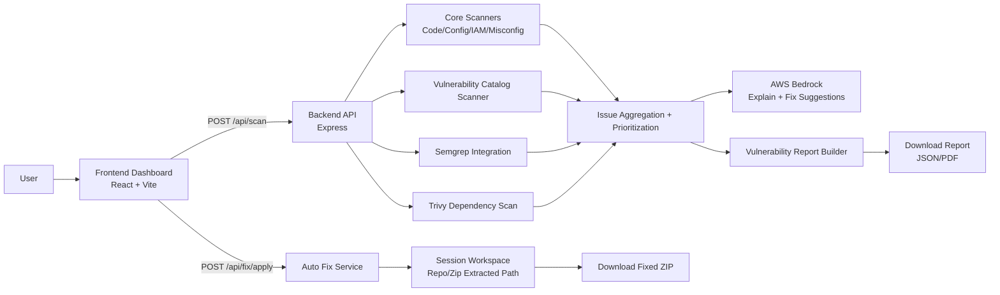
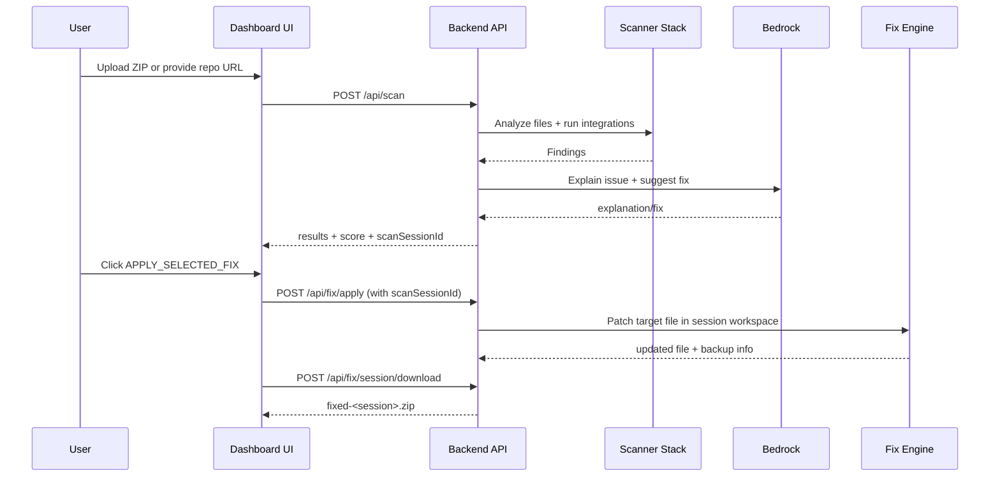

# SecSphere

A practical AI-assisted security review platform that scans code, configuration, IAM patterns, and dependencies, then helps apply safer fixes with downloadable outputs.

SecSphere supports three analysis inputs:

1. Single source/config file upload
2. ZIP project upload
3. GitHub repository URL

It also supports remediation workflows:

1. Per-finding fix apply
2. Session-based fixed ZIP download
3. JSON or PDF security report export for ZIP scans

## Why SecSphere

SecSphere is designed to be demo-friendly and developer-friendly:

1. Fast scanning with a cyber-style dashboard
2. AI explanation and remediation suggestions
3. Rule-based fallback logic when LLM output fails
4. Session-aware fixing so scanned repo/zip content can be patched later
5. Downloadable fixed artifacts and security reports

## Feature Highlights

| Capability | Description |
|---|---|
| Multi-source scanning | Analyze single files, ZIP archives, or GitHub repositories |
| Security engine | Local regex-based scanners + Semgrep + Trivy integration |
| AI analysis | Per-issue explanation and fix generation using AWS Bedrock |
| Learning loop | Accept user fix feedback and reuse learned patterns |
| Auto-fix engine | Applies safe heuristics for selected vulnerability classes |
| Session workflow | Keeps scan sessions for ZIP/repo so fixes can be applied later |
| Download support | Export fixed ZIP and security reports (JSON/PDF) |
| API docs | OpenAPI/Swagger available at /api-docs |

## Visual Architecture



## End-to-End Workflow



## Project Structure

```text
SecSphere/
	Frontend/                 # React + Vite + Tailwind dashboard
	backend/                  # Express API, scanners, integrations, fixes
	package.json              # Root scripts to run/build both apps
```

## Vulnerability Coverage

The platform includes a catalog scanner covering common security risks such as:

1. Sensitive data exposure
2. Injection patterns
3. Cross-site scripting (XSS)
4. Insecure file handling and path traversal
5. Missing input validation
6. Insecure authentication and access control patterns
7. Weak cryptography usage
8. Missing rate limiting signals
9. CORS/network misconfiguration
10. Insecure dependency indicators
11. Additional high-risk patterns including deserialization and suspicious backdoor markers

## Tech Stack

### Frontend

1. React 18
2. Vite 5
3. Tailwind CSS 3
4. React Router

### Backend

1. Node.js + Express 5
2. Multer (uploads)
3. fs-extra (file operations)
4. simple-git (repo cloning)
5. AWS Bedrock Runtime SDK
6. PDFKit (PDF report generation)
7. Swagger UI + OpenAPI docs

## API Quick Reference

| Method | Endpoint | Purpose |
|---|---|---|
| POST | /api/scan | Scan uploaded file/zip or GitHub repo |
| POST | /api/fix/apply | Apply selected fix to scanned session/project |
| POST | /api/fix/session/download | Download fixed ZIP from active scan session |
| POST | /api/fix/zip | Auto-fix ZIP and return fixed archive |
| POST | /api/fix/zip/report | Generate ZIP scan report (JSON/PDF) |
| POST | /api/feedback/fix | Save user-validated fix feedback |
| GET | /api/health | Health check |
| GET | /api-docs | Swagger UI |

## Local Setup

### Prerequisites

1. Node.js 18+
2. npm 9+
3. (Optional) Semgrep and Trivy installed if you want those integrations active

### Install Dependencies

```bash
npm --prefix backend install
npm --prefix Frontend install
```

### Environment Configuration

1. Copy backend env template and configure credentials/settings:

```bash
cp backend/.env.example backend/.env
```

2. (Optional) Copy frontend env template:

```bash
cp Frontend/.env.example Frontend/.env
```

## Run in Development

### Option A (root script)

```bash
npm run dev
```

Note: this script uses a bash-style command. If your shell does not support it, use Option B.

### Option B (recommended, two terminals)

Terminal 1:

```bash
npm --prefix backend run start
```

Terminal 2:

```bash
npm --prefix Frontend run dev
```

Default URLs:

1. Frontend: http://localhost:5173
2. Backend: http://localhost:5000
3. Swagger: http://localhost:5000/api-docs

## Production-Style Run

Build frontend assets:

```bash
npm run build
```

Start backend server:

```bash
npm run start
```

When Frontend/dist exists, the backend serves the UI and SPA routes while keeping API endpoints under /api.

## Demo Script (for presentations)

1. Open dashboard and upload a vulnerable ZIP
2. Run scan and review prioritized findings
3. Open a finding and apply selected fix
4. Download fixed ZIP from session workflow
5. Export security report in JSON or PDF
6. Show Swagger docs and endpoint payloads

## Security Notes

1. Auto-fix is intentionally conservative and only applies safe heuristic transformations.
2. Some findings still require manual remediation and code review.
3. Always re-scan and run tests after applying fixes.

## Roadmap Ideas

1. PR-level GitHub integration
2. SARIF export
3. Team policy profiles by domain
4. Auto-regression check after fix application

## License

This project currently does not specify a custom license in root metadata. Add a LICENSE file if you plan public distribution.
