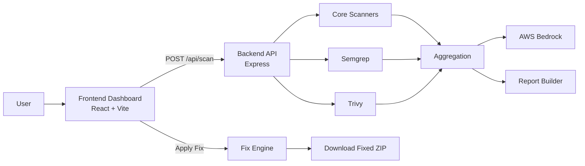
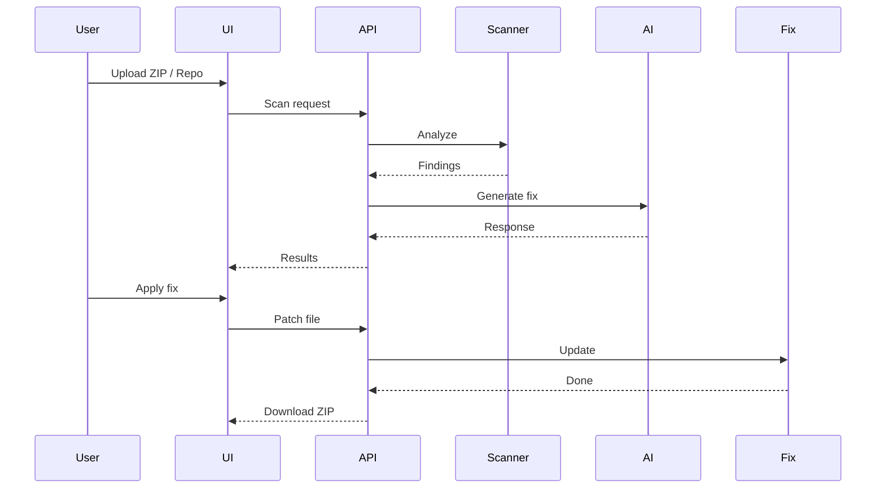

<div align="center">


# 🛡️ SecSphere

**A practical, AI-assisted security review platform that scans, explains, and automatically fixes vulnerabilities in your code.**

[](https://reactjs.org/)
[](https://nodejs.org/)
[](https://aws.amazon.com/)
[](https://tailwindcss.com/)

[Explore the Docs](#api-quick-reference) · [Report Bug](https://github.com/your-username/SecSphere/issues) · [Request Feature](https://github.com/your-username/SecSphere/issues)

</div>

---

## 🚀 See It In Action

<div align="center">
  
  <p><em>SecSphere identifying a vulnerability and applying an AI-generated fix in real-time.</em></p>
</div>

SecSphere supports three rapid analysis inputs:

* 📄 Single File Upload
* 📦 ZIP Project Upload
* 🔗 GitHub Repository URL

---

## ✨ Feature Highlights

| 🔍 Multi-Source Scanning             | 🧠 AI-Powered Analysis                  | 🛠️ Auto-Fix Engine       |
| :----------------------------------- | :-------------------------------------- | :------------------------ |
| Analyze files, ZIPs, or GitHub repos | AI explanations + fixes via AWS Bedrock | Safe heuristic auto-fixes |

| 🔄 Session Workflow      | 📥 Artifact Export           | 🎓 Learning Loop          |
| :----------------------- | :--------------------------- | :------------------------ |
| Persistent scan sessions | Download fixed ZIP + reports | Learns from user feedback |

---

## 🏗️ Visual Architecture



---

## 🔄 Workflow



---

## ⚙️ Installation

```bash
npm --prefix backend install
npm --prefix Frontend install
```

---

## ▶️ Run Locally

### Backend

```bash
npm --prefix backend run start
```

### Frontend

```bash
npm --prefix Frontend run dev
```

---

## 🌐 URLs

* Frontend → http://localhost:5173
* Backend → http://localhost:5000
* Swagger → http://localhost:5000/api-docs

---

## 📌 API Quick Reference

| Method | Endpoint                  | Purpose      |
| ------ | ------------------------- | ------------ |
| POST   | /api/scan                 | Scan code    |
| POST   | /api/fix/apply            | Apply fix    |
| POST   | /api/fix/session/download | Download ZIP |
| GET    | /api-docs                 | Swagger UI   |

---

## 🔒 Security Notes

* Auto-fix is conservative
* Manual review still needed
* Always re-scan after fixes

---

## 🚀 Future Scope

* GitHub PR integration
* SARIF export
* Team-based policies

---

